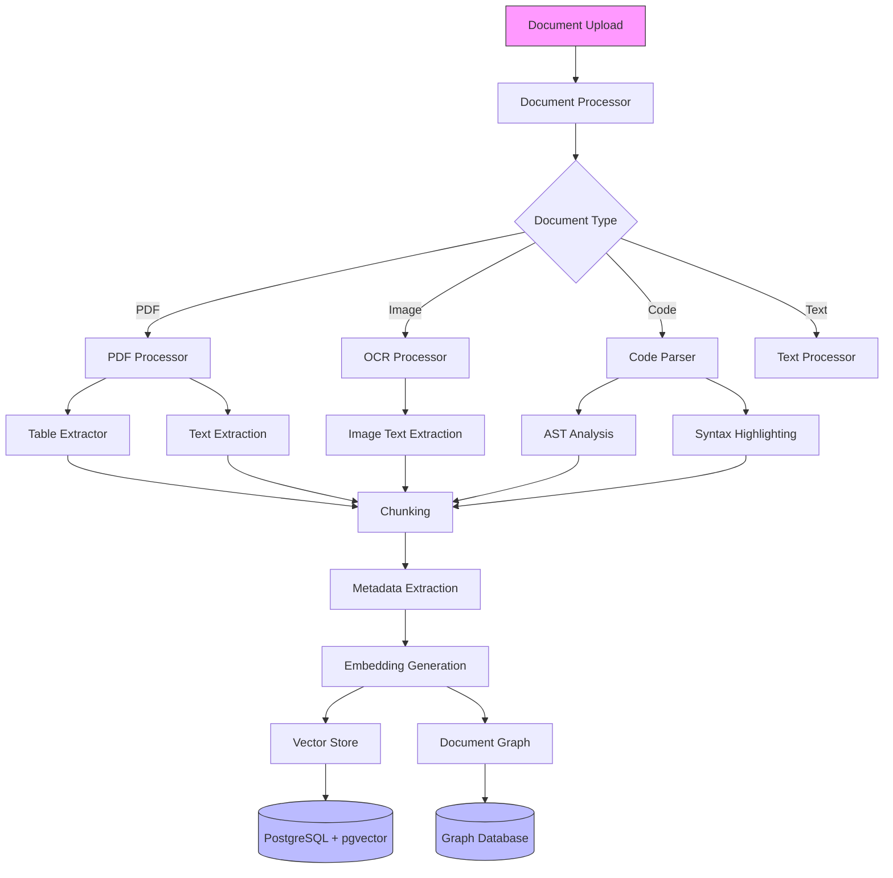
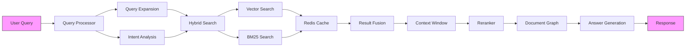

# File Upload Embeddings System

## Strategic Overview

The File Upload Embeddings System is an enterprise-grade document intelligence platform that transforms how organizations process, understand, and retrieve information from their document repositories. By leveraging advanced vector embeddings and state-of-the-art language models, it bridges the gap between traditional document management systems and modern AI-powered information retrieval.

### System Architecture

#### Document Processing Pipeline


#### Optimized RAG Architecture


### Performance Metrics

Based on our benchmark testing, the system achieves:

- Document Processing: Average processing speed of 50-100 documents per second
- Search Latency: Average query response time < 200ms
- Cache Performance: 2.5-3x speedup with Redis caching
- Concurrent Operations: Supports 10+ concurrent users with minimal latency increase
- Graph Operations: Average traversal time < 50ms for related document retrieval
- Context Windows: Dynamic window generation in < 100ms
- Query Expansion: Real-time expansion with < 50ms overhead

### Database Schema

The system uses a sophisticated PostgreSQL schema with pgvector extension:

```sql
documents
- id (Primary Key)
- filename
- content_type
- file_size
- created_at
- updated_at
- doc_metadata (JSON)

document_chunks
- id (Primary Key)
- document_id (Foreign Key)
- content (Text)
- chunk_index
- embedding (Vector(1536))
- token_count
- chunk_metadata (JSON)
- created_at

chat_sessions
- id (Primary Key)
- created_at
- updated_at
- session_metadata (JSON)

chat_messages
- id (Primary Key)
- session_id (Foreign Key)
- role
- content
- created_at
- message_metadata (JSON)
```

### Caching Strategy

The system implements a sophisticated multi-level caching strategy:

1. **Dual Connection Pools**
   - Text Pool: For JSON and metadata
   - Binary Pool: For embeddings and large objects

2. **Cache Keys**
   - Embeddings: `emb:{hash(text)}`
   - Queries: `q:{hash(query)}:d:{doc_id}`
   - Documents: `doc:{doc_id}`

3. **Performance Features**
   - Automatic compression
   - Connection pooling
   - Health checks
   - Error tracking
   - Performance metrics

## Prerequisites

- Docker and Docker Compose
- Python 3.10+
- PostgreSQL 13+ with pgvector extension
- Redis 6+
- At least 4GB RAM
- 10GB free disk space
- OpenAI API key or Azure OpenAI credentials

## Quick Start

1. Clone the repository:
   ```bash
   git clone https://github.com/terilios/file-upload-embeddings.git
   cd file-upload-embeddings
   ```

2. Create a .env file:
   ```env
   # Required: Choose either OpenAI API or Azure OpenAI
   OPENAI_API_KEY=your_api_key_here

   # Optional: Azure OpenAI Configuration
   AZURE_OPENAI_API_KEY=your_azure_key
   AZURE_OPENAI_API_BASE=your_azure_endpoint
   AZURE_OPENAI_API_VERSION=your_api_version
   AZURE_OPENAI_DEPLOYMENT_NAME=your_deployment_name

   # Database Configuration
   POSTGRES_USER=postgres
   POSTGRES_PASSWORD=postgres
   POSTGRES_DB=file_upload_embeddings

   # Redis Configuration
   REDIS_URL=redis://redis:6379/0

   # Grafana Configuration (optional)
   GRAFANA_ADMIN_PASSWORD=admin
   ```

3. Start the services:
   ```bash
   docker-compose up -d
   ```

4. Access the interfaces:
   - Frontend UI: http://localhost:8501
   - API Documentation: http://localhost:8000/docs
   - Grafana Dashboard: http://localhost:3000 (admin/admin)
   - Prometheus: http://localhost:9090

## Project Structure

```
.
├── app/
│   ├── backend/          # FastAPI application
│   │   ├── api/         # API routes and endpoints
│   │   └── core/        # Core backend functionality
│   ├── frontend/        # Streamlit interface
│   ├── database/        # Database models and operations
│   ├── document_processing/  # Document handling
│   ├── cache/          # Redis caching implementation
│   ├── monitoring/     # Logging and metrics
│   └── rag/           # Retrieval and generation
├── config/            # Configuration files
├── monitoring/        # Monitoring configuration
│   ├── grafana/      # Grafana dashboards and config
│   └── prometheus/   # Prometheus config and rules
├── scripts/          # Utility scripts
├── tests/           # Test suite
├── uploads/         # Document upload directory
└── logs/           # Application logs
```

## Testing

The system includes comprehensive test suites:

### Performance Tests
```bash
pytest tests/test_integration/test_performance_benchmark.py
```
Tests cover:
- Document processing throughput
- Search performance
- Graph operations
- Context window generation
- Query expansion
- Cache performance
- Concurrent operations

### Integration Tests
```bash
pytest tests/test_integration/
```

### Unit Tests
```bash
pytest tests/test_unit/
```

## Contributing

1. Fork the repository
2. Create a feature branch
3. Make your changes
4. Add tests
5. Create a pull request

## License

This project is licensed under the MIT License - see the LICENSE file for details.

## About Terilios

[Terilios](https://terilios.com) specializes in developing cutting-edge AI and machine learning solutions for enterprise document processing and information retrieval. Our File Upload Embeddings System represents our commitment to pushing the boundaries of what's possible in document intelligence and semantic search technology.
