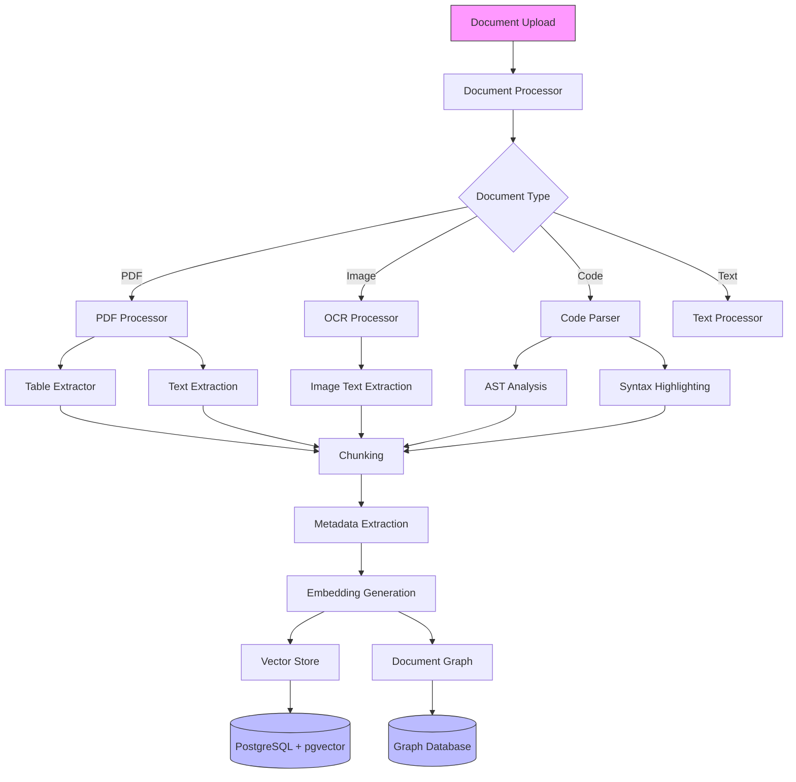
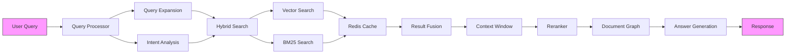

# File Upload Embeddings System

## Strategic Overview

The File Upload Embeddings System is an enterprise-grade document intelligence platform that transforms how organizations process, understand, and retrieve information from their document repositories. By leveraging advanced vector embeddings and state-of-the-art language models, it bridges the gap between traditional document management systems and modern AI-powered information retrieval.

### System Architecture

#### Document Processing Pipeline


#### Optimized RAG Architecture


### Key Value Propositions

- **Intelligent Document Understanding**: Automatically extract and understand content from any document format, including complex tables, code snippets, and scanned documents.
- **Semantic Search & Discovery**: Go beyond keyword matching with context-aware search that understands the meaning behind queries.
- **Enterprise-Ready Architecture**: Built with scalability, security, and performance in mind, supporting high-throughput document processing and real-time retrieval.
- **Comprehensive Analytics**: Deep insights into document usage, search patterns, and system performance through integrated monitoring.

### Target Use Cases

1. **Enterprise Knowledge Management**
   - Centralize and make searchable all corporate documentation
   - Enable semantic search across multiple document formats
   - Maintain document relationships and cross-references

2. **Technical Documentation Systems**
   - Process and analyze code repositories
   - Extract insights from technical specifications
   - Enable context-aware code search and reference

3. **Research & Analysis Platforms**
   - Process academic papers and research documents
   - Extract and analyze data tables and figures
   - Enable cross-document citation and reference tracking

4. **Compliance & Legal Document Processing**
   - Automated document classification and analysis
   - Extract and track key clauses and terms
   - Maintain audit trails and document lineage

### Advanced RAG Architecture

This system goes far beyond naive RAG (Retrieval-Augmented Generation) implementations, offering superior performance and accuracy through several key innovations:

#### 1. Intelligent Document Processing
- **Adaptive Chunking**: Context-aware document splitting based on content type and structure
- **Specialized Handlers**: Dedicated processing for tables, code blocks, and images
- **Semantic Preservation**: Maintains document hierarchy and relationships
- **Multi-Modal Processing**: Integrated OCR and code parsing capabilities

#### 2. Enhanced Retrieval System
- **Hybrid Search**: Combines BM25 and vector similarity for superior results
- **Dynamic Context**: Adaptive window sizing based on query complexity
- **Document Graph Analysis**: Understands and utilizes document relationships
- **Query Enhancement**: Automatic expansion with domain-specific terms

#### 3. Enterprise Optimization
- **Advanced Caching**: Multi-level caching strategy with Redis
- **Performance Tuning**: Optimized database indexes and connection pooling
- **Parallel Processing**: Efficient handling of batch operations
- **Comprehensive Monitoring**: Real-time performance tracking and alerting

## Prerequisites

- Docker and Docker Compose
- Python 3.10+
- PostgreSQL 13+ with pgvector extension
- Redis 6+
- At least 4GB RAM
- 10GB free disk space
- OpenAI API key or Azure OpenAI credentials

## Quick Start

1. Clone the repository:
   ```bash
   git clone https://github.com/terilios/file-upload-embeddings.git
   cd file-upload-embeddings
   ```

2. Create a .env file:
   ```env
   # Required: Choose either OpenAI API or Azure OpenAI
   OPENAI_API_KEY=your_api_key_here

   # Optional: Azure OpenAI Configuration
   AZURE_OPENAI_API_KEY=your_azure_key
   AZURE_OPENAI_API_BASE=your_azure_endpoint
   AZURE_OPENAI_API_VERSION=your_api_version
   AZURE_OPENAI_DEPLOYMENT_NAME=your_deployment_name

   # Database Configuration
   POSTGRES_USER=postgres
   POSTGRES_PASSWORD=postgres
   POSTGRES_DB=file_upload_embeddings

   # Redis Configuration
   REDIS_URL=redis://redis:6379/0

   # Grafana Configuration (optional)
   GRAFANA_ADMIN_PASSWORD=admin
   ```

3. Start the services:
   ```bash
   docker-compose up -d
   ```

4. Access the interfaces:
   - Frontend UI: http://localhost:8501
   - API Documentation: http://localhost:8000/docs
   - Grafana Dashboard: http://localhost:3000 (admin/admin)
   - Prometheus: http://localhost:9090

## Project Structure

```
.
├── app/
│   ├── backend/          # FastAPI application
│   │   ├── api/         # API routes and endpoints
│   │   └── core/        # Core backend functionality
│   ├── frontend/        # Streamlit interface
│   ├── database/        # Database models and operations
│   ├── document_processing/  # Document handling
│   ├── cache/          # Redis caching implementation
│   ├── monitoring/     # Logging and metrics
│   └── rag/           # Retrieval and generation
├── config/            # Configuration files
├── monitoring/        # Monitoring configuration
│   ├── grafana/      # Grafana dashboards and config
│   └── prometheus/   # Prometheus config and rules
├── scripts/          # Utility scripts
├── tests/           # Test suite
├── uploads/         # Document upload directory
└── logs/           # Application logs
```

## Features

### Document Processing
- Intelligent chunking with adaptive sizes
- Vector embeddings generation
- Table extraction from PDFs
- OCR for images and scanned documents
- Code parsing with syntax highlighting
- Batch processing with parallel execution

### Advanced Retrieval
- Hybrid search (BM25 + Vector Similarity)
- Cross-document references
- Dynamic context windows
- Query expansion
- Document graph analysis

### System Features
- Redis caching
- Connection pooling
- Query optimization
- Performance monitoring
- Comprehensive logging

## Monitoring Setup

### Prometheus
- Metrics collection from all services
- Custom alerting rules
- Performance and resource monitoring
- Query latency tracking

### Grafana
- Pre-configured dashboards
- System metrics visualization
- Document processing metrics
- Search performance analytics
- Cache hit rates
- Resource utilization

Access the monitoring stack:
1. Grafana: http://localhost:3000 (default: admin/admin)
   - System Metrics Dashboard
   - Vector Search Performance
   - Document Processing Pipeline
   - Cache Performance

2. Prometheus: http://localhost:9090
   - Raw metrics
   - Query explorer
   - Alert manager

## Development Setup

1. Create a virtual environment:
   ```bash
   python -m venv venv
   source venv/bin/activate  # Linux/Mac
   # or
   .\venv\Scripts\activate  # Windows
   ```

2. Install dependencies:
   ```bash
   pip install -r requirements.txt
   ```

3. Run tests:
   ```bash
   pytest
   ```

4. Start services individually:
   ```bash
   # Backend
   uvicorn app.backend.main:app --reload --port 8000

   # Frontend
   streamlit run app/frontend/main.py
   ```

## Configuration

### Database Settings
```python
# config/settings.py
POSTGRES_CONFIG = {
    'host': 'postgres',
    'port': 5432,
    'database': 'file_upload_embeddings',
    'pool_size': 20,
    'max_overflow': 10
}
```

### Cache Settings
```python
# config/settings.py
REDIS_CONFIG = {
    'url': 'redis://redis:6379/0',
    'pool_size': 20,
    'timeout': 300
}
```

### Processing Settings
```python
# config/settings.py
PROCESSING_CONFIG = {
    'chunk_size': 1000,
    'overlap': 200,
    'batch_size': 50,
    'max_workers': 4
}
```

## Testing

### Unit Tests
```bash
pytest tests/test_unit/
```

### Integration Tests
```bash
pytest tests/test_integration/
```

### Performance Tests
```bash
pytest tests/test_integration/test_performance_benchmark.py
```

## Contributing

1. Fork the repository
2. Create a feature branch
3. Make your changes
4. Add tests
5. Create a pull request

## License

This project is licensed under the MIT License - see the LICENSE file for details.

## About Terilios

[Terilios](https://terilios.com) specializes in developing cutting-edge AI and machine learning solutions for enterprise document processing and information retrieval. Our File Upload Embeddings System represents our commitment to pushing the boundaries of what's possible in document intelligence and semantic search technology.
