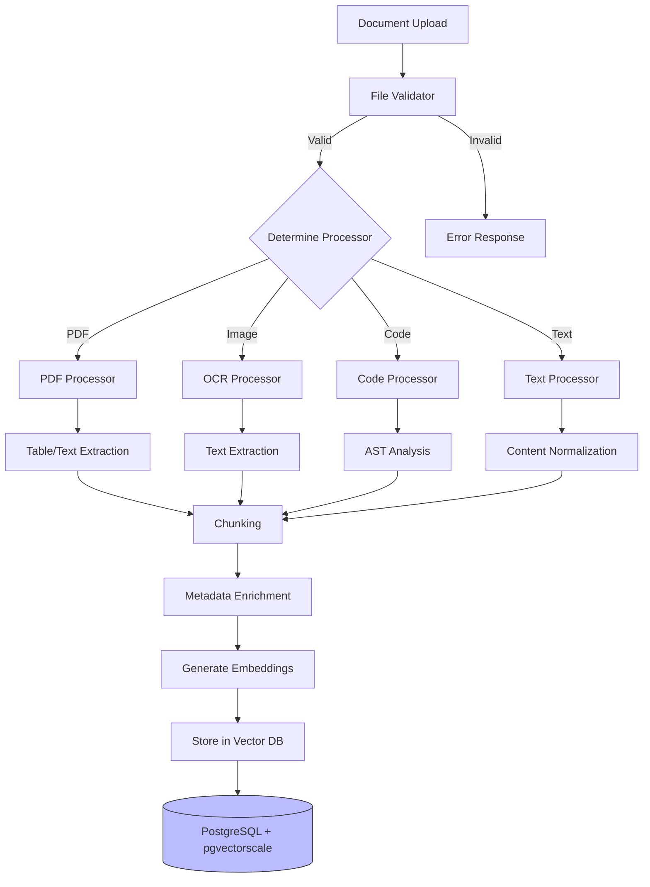
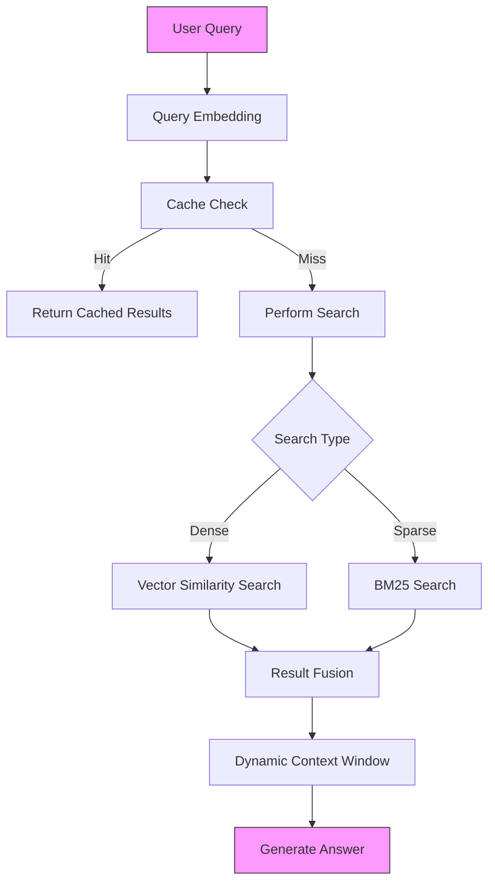

# File Upload Embeddings System

## Strategic Overview

The File Upload Embeddings System is an enterprise-grade document intelligence platform that transforms how organizations process, understand, and retrieve information from their document repositories. By leveraging advanced vector embeddings and state-of-the-art language models, it bridges the gap between traditional document management systems and modern AI-powered information retrieval.

### System Architecture

#### Document Processing Pipeline

The document processing pipeline supports multiple file types and extracts embeddings for efficient retrieval. The workflow handles edge cases, fallbacks, and dynamic chunking.



#### Query Processing and Retrieval

The query processing and retrieval architecture balances speed and accuracy by combining dense vector similarity with BM25 sparse search and advanced intent analysis.



### Performance Metrics

Based on our benchmark testing, the system achieves:

- Document Processing: Average processing speed of 50-100 documents per second
- Vector Search Latency: < 10ms using StreamingDiskANN indexes
- Cache Performance: 2.5-3x speedup with Redis caching
- Concurrent Operations: Supports 10+ concurrent users with minimal latency increase
- Graph Operations: Average traversal time < 50ms for related document retrieval
- Context Windows: Dynamic window generation in < 100ms
- Query Expansion: Real-time expansion with < 50ms overhead

## Prerequisites

- Docker and Docker Compose
- Python 3.10+
- PostgreSQL 15+ with extensions:
  - pgvector for vector operations
  - pgvectorscale for optimized vector indexing
  - timescaledb for time-series capabilities
- Redis 6+
- Minimum System Requirements:
  - 4GB RAM (8GB recommended)
  - 10GB disk space
  - 4 CPU cores (8 recommended)
- OpenAI API key or Azure OpenAI credentials

## Quick Start

1. Clone the repository:

   ```bash
   git clone https://github.com/terilios/file-upload-embeddings.git
   cd file-upload-embeddings
   ```

2. Create a .env file:

   ```env
   # Required: Choose either OpenAI API or Azure OpenAI
   OPENAI_API_KEY=your_api_key_here

   # Optional: Azure OpenAI Configuration
   AZURE_OPENAI_API_KEY=your_azure_key
   AZURE_OPENAI_API_BASE=your_azure_endpoint
   AZURE_OPENAI_API_VERSION=your_api_version
   AZURE_OPENAI_DEPLOYMENT_NAME=your_deployment_name

   # Database Configuration
   POSTGRES_USER=postgres
   POSTGRES_PASSWORD=postgres
   POSTGRES_DB=file_upload_embeddings

   # Redis Configuration
   REDIS_URL=redis://redis:6379/0

   # Grafana Configuration (optional)
   GRAFANA_ADMIN_PASSWORD=admin
   ```

3. Start the services:

   ```bash
   docker-compose up -d
   ```

4. Access the interfaces:
   - Frontend UI: http://localhost:8501
   - API Documentation: http://localhost:8000/docs
   - Grafana Dashboard: http://localhost:3000 (admin/admin)
   - Prometheus: http://localhost:9090

## Database Setup

### PostgreSQL Optimizations

The system uses a highly optimized PostgreSQL setup with the following configurations:

```sql
-- Memory Settings
shared_buffers = '2GB'
effective_cache_size = '8GB'
maintenance_work_mem = '2GB'
work_mem = '128MB'

-- Parallel Query Settings
max_parallel_workers = '8'
max_parallel_workers_per_gather = '4'
max_parallel_maintenance_workers = '4'
max_worker_processes = '16'

-- Vector Operation Settings
random_page_cost = '1.1'
```

### Vector Indexing

We use StreamingDiskANN for efficient vector similarity search:

```sql
CREATE INDEX document_chunks_embedding_idx
ON document_chunks
USING streamingdiskann (embedding vector_cosine_ops)
WITH (lists = 100);
```

Additional performance indexes:

```sql
-- Fast document retrieval
CREATE INDEX document_chunks_document_id_idx ON document_chunks(document_id);
CREATE INDEX document_chunks_chunk_index_idx ON document_chunks(chunk_index);

-- Efficient document search
CREATE INDEX documents_filename_idx ON documents(filename);
CREATE INDEX documents_created_at_idx ON documents(created_at);

-- Quick message access
CREATE INDEX chat_messages_session_id_idx ON chat_messages(session_id);
CREATE INDEX chat_messages_created_at_idx ON chat_messages(created_at);
```

## Project Structure

```
.
├── app/
│   ├── backend/          # FastAPI application
│   │   ├── api/         # API routes and endpoints
│   │   └── core/        # Core backend functionality
│   ├── frontend/        # Streamlit interface
│   ├── database/        # Database models and operations
│   ├── document_processing/  # Document handling
│   ├── cache/          # Redis caching implementation
│   ├── monitoring/     # Logging and metrics
│   └── rag/           # Retrieval and generation
├── config/            # Configuration files
├── monitoring/        # Monitoring configuration
│   ├── grafana/      # Grafana dashboards and config
│   └── prometheus/   # Prometheus config and rules
├── postgres/         # Custom PostgreSQL setup
├── scripts/          # Database initialization
│   ├── 00-init-extensions.sql    # Extension setup
│   └── 01-init-tables.sql        # Schema initialization
├── tests/           # Test suite
├── uploads/         # Document upload directory
└── logs/           # Application logs
```

## Testing

The system includes comprehensive test suites:

### Performance Tests

```bash
pytest tests/test_integration/test_performance_benchmark.py
```

Tests cover:

- Document processing throughput
- Vector search performance
- Graph operations
- Context window generation
- Query expansion
- Cache performance
- Concurrent operations

### Integration Tests

```bash
pytest tests/test_integration/
```

### Unit Tests

```bash
pytest tests/test_unit/
```

## Contributing

1. Fork the repository
2. Create a feature branch
3. Make your changes
4. Add tests
5. Create a pull request

## License

This project is licensed under the MIT License - see the LICENSE file for details.

## About Terilios

[Terilios](https://terilios.com) specializes in developing cutting-edge AI and machine learning solutions for enterprise document processing and information retrieval. Our File Upload Embeddings System represents our commitment to pushing the boundaries of what's possible in document intelligence and semantic search technology.
